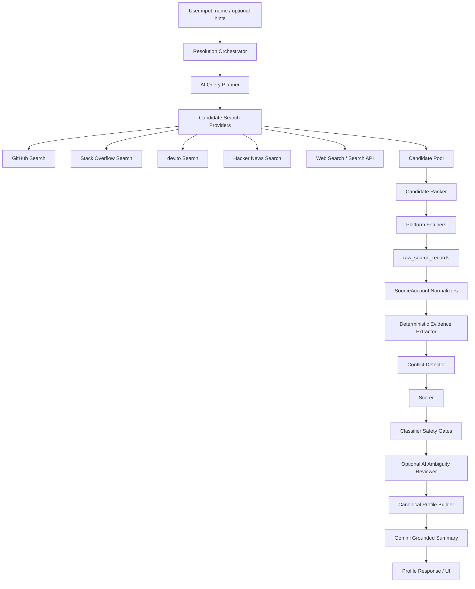

# Next Week Plan — Dev Profile Unifier

> A one-week product and engineering roadmap for taking Dev Profile Unifier from a strong deterministic take-home implementation into a more intelligent, production-grade identity-resolution system.

## 1. Executive Summary

The current system is intentionally deterministic-first: it fetches public developer accounts, stores raw payloads, normalizes each account, extracts evidence, detects conflicts, scores confidence, and only builds the canonical profile from accounts classified as `auto_match`. This is the right baseline for a take-home project because entity resolution must be explainable, testable, and conservative.

With one more week, I would not replace the deterministic resolver with an LLM-only system. Instead, I would add an **agentic AI investigation layer** around the existing deterministic core.

The future version would work like this:

1. The deterministic resolver remains the safety layer.
2. AI agents help with discovery, query planning, evidence collection, and ambiguity analysis.
3. Every AI-generated lead must be converted into structured evidence.
4. The final merge decision still passes through deterministic safety gates.
5. Ambiguous or high-risk cases remain reviewable instead of being silently merged.

This creates a more intelligent system without losing the key property that makes the current design reliable: every decision can be explained and audited.

---

## 2. Current Baseline

The current implementation already includes the core platform required for production-oriented entity resolution:

- FastAPI backend.
- Supabase persistence.
- GitHub, Stack Overflow, dev.to, and Hacker News integrations.
- Raw API response storage before transformation.
- Normalized `SourceAccount` model.
- Deterministic evidence extraction.
- Conflict detection.
- Weighted scoring.
- `auto_match`, `needs_review`, and `reject` decisions.
- Multi-anchor conflict handling.
- Target identity conflict handling.
- Canonical profile construction from accepted sources only.
- Optional Gemini summary generation.
- Optional Gemini ambiguity review.
- API metrics and LLM metrics.
- Health and dashboard observability.
- FastAPI-native demo UI.

The main limitation is that the system is strongest when the user supplies one or more direct identifiers. It does not yet fully solve the more open-ended problem:

> “Here is a person’s name. Find all likely public developer accounts for that person, rank them, compare them across platforms, and build the best explainable profile.”

That is the main direction for next week.

---

## 3. Product Goal for Next Week

The goal for the next week would be to make Dev Profile Unifier more autonomous and more intelligent while preserving safety.

### Primary goal

Build an **AI-assisted candidate discovery and resolution workflow** that can start from only a name and produce ranked identity candidates across supported platforms.

### Secondary goal

Improve the review and observability experience so users can understand why the system accepted, rejected, or flagged each account.

### Non-goal

The goal is not to let an LLM directly decide identity ownership. That would make the system less reliable. The LLM should assist investigation, not bypass evidence rules.

---

## 4. Design Principle: AI Agent as Investigator, Deterministic Core as Judge

Entity resolution has a dangerous failure mode: merging two different people into one profile. Because of that, the system should separate responsibilities clearly.

| Layer | Responsibility |
|---|---|
| AI investigation layer | Search, propose candidates, summarize evidence, identify missing information, suggest follow-up queries. |
| Deterministic resolver | Apply scoring, thresholds, conflict gates, and final merge policy. |
| Database evidence layer | Store raw payloads, normalized accounts, evidence, conflicts, decisions, and audit metadata. |
| Human review layer | Handle genuinely ambiguous or high-risk cases. |

This keeps the future system intelligent without making it unbounded or unexplainable.

---

## 5. Proposed Next-Week Architecture



The key difference from the current system is the new discovery layer:

- AI query planner.
- Candidate search providers.
- Candidate ranking.
- Follow-up investigation loop.

Everything after candidate fetch still uses the current evidence-first resolver.

---

## 6. Main Workstreams

## Workstream 1 — Name-Only Candidate Discovery

### Problem

The current system works best when the user supplies platform handles or URLs. In the next version, the system should also handle this input:

```json
{
  "name": "Simon Willison"
}
```

and return likely accounts such as:

- GitHub candidates.
- Stack Overflow candidates.
- dev.to candidates.
- Hacker News candidates.
- personal website candidates.
- other public developer references.

### Proposed implementation

Add a `CandidateSearchService` with platform-specific search adapters.

Initial adapters:

| Platform | Search strategy |
|---|---|
| GitHub | Search users by name/handle and rank by name, bio, website, location, repos, followers. |
| Stack Overflow | Search users by display name and rank by reputation, profile link, website, location, tags. |
| dev.to | Search users/articles where available and rank by handle/name/website/topic overlap. |
| Hacker News | Search Algolia users/items for username and activity references. |
| Web search | Search for `"name" GitHub`, `"name" Stack Overflow`, `"name" dev.to`, personal sites, talks, blogs. |

### Ranking signals

Candidates should be ranked before full resolution using lightweight signals:

| Signal | Description |
|---|---|
| exact name match | Candidate display name exactly matches the requested name. |
| handle similarity | Handle resembles the name or known aliases. |
| personal website match | Candidate has a personal domain that also appears elsewhere. |
| profile link evidence | One platform links to another platform. |
| topic overlap | Repositories, tags, or articles match known developer topics. |
| location/company overlap | Public location or company aligns across accounts. |
| activity quality | Account has enough public activity to be useful. |
| source reliability | Some signals are stronger on richer platforms than sparse platforms. |

### Expected output

The API should return ranked candidate clusters, not just a single answer:

```json
{
  "query": "Simon Willison",
  "top_candidates": [
    {
      "rank": 1,
      "candidate_identity": "Simon Willison",
      "confidence": 0.91,
      "sources": ["github", "hackernews", "personal_site"],
      "reason": "Name, handle, website, and topic evidence align."
    },
    {
      "rank": 2,
      "candidate_identity": "Different Simon Willison",
      "confidence": 0.47,
      "sources": ["github"],
      "reason": "Name match but weak cross-source evidence."
    }
  ]
}
```

### Safety rule

Name-only discovery should never auto-merge solely because a name matches. Public names are not unique.

---

## Workstream 2 — Agentic AI Resolution Planner

### Problem

The deterministic system is reliable, but it cannot intelligently decide what information to look for next. For example, if GitHub and Stack Overflow look similar but not conclusive, the system should know to search for:

- personal websites;
- profile cross-links;
- blog author pages;
- conference speaker pages;
- linked social profiles;
- package registry profiles;
- direct mentions of platform handles.

### Proposed implementation

Add a bounded `ResolutionInvestigationAgent`.

The agent should not decide final identity matches. Its job is to produce structured investigation actions.

Example output:

```json
{
  "investigation_plan": [
    {
      "action": "search_web",
      "query": "\"Simon Willison\" \"github.com/simonw\"",
      "reason": "Look for public references connecting the name and GitHub account."
    },
    {
      "action": "search_web",
      "query": "\"Simon Willison\" \"news.ycombinator.com/user?id=simonw\"",
      "reason": "Check whether the Hacker News handle is publicly associated with the same person."
    }
  ],
  "stop_condition": "Stop after strong profile-link, website, or independent source evidence is found."
}
```

### Guardrails

- The agent can only propose actions from an allowlist.
- The agent cannot write directly to canonical profiles.
- The agent cannot mark accounts as accepted.
- The agent output must be schema-validated.
- Every discovered source must still pass through normal ingestion, evidence extraction, and scoring.
- The system should cap the number of searches per resolution run.

### Why this improves the system

This makes the resolver behave more like a human analyst:

1. Start with available clues.
2. Search for missing evidence.
3. Compare candidate accounts.
4. Stop when evidence is strong enough or ambiguity remains.

---

## Workstream 3 — AI-Assisted Candidate Ranking

### Problem

When a name-only search returns many candidates, simple deterministic ranking can miss semantic clues.

Example:

- One candidate bio says “creator of Datasette.”
- Another candidate website mentions “Datasette, LLM, SQLite.”
- A third profile has the same name but unrelated topics.

An AI ranking layer can help identify meaningful semantic overlap.

### Proposed implementation

Add `CandidateRankingService` with two stages:

1. Deterministic pre-ranker.
2. Optional LLM semantic reranker for top candidates only.

The LLM should only receive compact candidate summaries, not full raw payloads.

Example input to LLM reranker:

```json
{
  "target_name": "Simon Willison",
  "candidates": [
    {
      "candidate_id": "github:simonw",
      "display_name": "Simon Willison",
      "bio": "Open source developer...",
      "website": "simonwillison.net",
      "topics": ["python", "sqlite", "llm"]
    }
  ]
}
```

Example output:

```json
{
  "ranked_candidates": [
    {
      "candidate_id": "github:simonw",
      "semantic_rank": 1,
      "rationale": "Name, personal site, and topics align strongly."
    }
  ]
}
```

### Rate-limit control

Because the project may run on free-tier Gemini, the LLM reranker should be used only after deterministic filtering.

Rules:

- Never call Gemini for every raw search result.
- Only rerank the top N deterministic candidates.
- Cache candidate ranking decisions by input hash.
- Use a shared Gemini client and rate limiter.
- Respect configured RPM, TPM, and RPD limits from environment variables.
- Fall back to deterministic ranking when the LLM is unavailable or quota is exhausted.

---

## Workstream 4 — Human Review Workflow

### Problem

The system already stores `needs_review` candidates, but there is no dedicated review workflow yet.

### Proposed implementation

Add a lightweight review layer:

- `review_cases` table.
- `review_decisions` table.
- UI page for each review case.
- Ability to approve, reject, or mark as alias.
- Audit trail of reviewer action.

### Proposed tables

#### `review_cases`

| Column | Purpose |
|---|---|
| `id` | Review case ID. |
| `profile_id` | Canonical profile under review. |
| `source_account_id` | Candidate being reviewed. |
| `status` | `open`, `approved`, `rejected`, `needs_more_evidence`. |
| `reason` | Why this was flagged. |
| `evidence_snapshot` | Evidence available at time of review. |
| `created_at`, `updated_at` | Audit timestamps. |

#### `review_decisions`

| Column | Purpose |
|---|---|
| `id` | Decision ID. |
| `review_case_id` | Parent review case. |
| `decision` | Human decision. |
| `notes` | Reviewer explanation. |
| `created_at` | Audit timestamp. |

### Why this matters

The best entity-resolution systems do not pretend every case can be solved automatically. The correct design is:

- auto-merge safe cases;
- reject obvious mismatches;
- route ambiguous cases to review.

---

## Workstream 5 — Durable Async Jobs

### Problem

The current API resolves profiles synchronously. This is acceptable for a take-home demo, but name-only discovery and agentic follow-up searches can take longer.

### Proposed implementation

Convert resolution into a durable job workflow.

New endpoints:

| Endpoint | Purpose |
|---|---|
| `POST /profiles/resolve` | Creates a resolution job and returns `run_id`. |
| `GET /profiles/runs/{run_id}` | Returns job status and partial progress. |
| `GET /profiles/{profile_id}` | Returns final profile when completed. |

Potential implementation options:

- Supabase-backed job table with worker process.
- Redis Queue / RQ.
- Celery.
- Render worker service.
- Cloud task queue if moved beyond Render.

### Job states

```text
queued
fetching_sources
normalizing
extracting_evidence
reviewing_ambiguity
building_profile
summarizing
completed
partial
failed
```

### Why this matters

Async jobs would allow:

- retrying failed providers;
- progress UI;
- larger discovery workflows;
- safer timeout handling;
- resumable resolution runs.

---

## Workstream 6 — Evaluation and Regression Suite

### Problem

Entity resolution quality cannot be measured only with unit tests. The system needs an evaluation set with known expected outcomes.

### Proposed implementation

Create `tests/fixtures/identity_cases.json`.

Example cases:

```json
[
  {
    "name": "Simon Willison",
    "input": {"github": "simonw"},
    "expected": {
      "github:simonw": "auto_match"
    }
  },
  {
    "name": "Linus Torvalds",
    "input": {"github": "simonw"},
    "expected": {
      "github:simonw": "needs_review"
    }
  },
  {
    "name": "Jon Skeet",
    "input": {"github": "simonw", "stackoverflow_user_id": "22656"},
    "expected": {
      "stackoverflow:22656": "auto_match",
      "github:simonw": "needs_review"
    }
  }
]
```

Evaluation metrics:

| Metric | Meaning |
|---|---|
| false merge rate | Different people incorrectly merged. Most important metric. |
| false reject rate | Same person incorrectly rejected. |
| review rate | Percentage of ambiguous cases routed to review. |
| evidence coverage | Percentage of decisions with stored evidence. |
| resolver latency | Time per resolution run. |
| API reliability | Per-provider failure rate. |
| LLM usage | Tokens, retries, wait time, fallback rate. |

The most important metric is false merge rate. A conservative review result is better than a confident wrong merge.

---

## Workstream 7 — Better Evidence Explainability UI

### Problem

The current UI shows accepted/review/rejected sources and confidence, but a reviewer should be able to inspect the underlying evidence directly.

### Proposed improvements

Add an evidence detail panel for each source account:

- positive evidence list;
- negative evidence list;
- conflict list;
- account-vs-target evidence;
- account-vs-account evidence;
- LLM review note when available;
- reason the candidate was accepted, reviewed, or rejected.

Example UI copy:

```text
GitHub simonw was moved to needs_review because its public display name is Simon Willison, while the requested name is Linus Torvalds. No strong linking evidence connects this account to the requested identity.
```

This makes the system easier to trust during demos and real-world usage.

---

## Workstream 8 — Source Expansion

### Problem

Developer identity is spread across more than four platforms.

### Next platforms

| Source | Why useful |
|---|---|
| Personal websites/blogs | Often contain direct links to platform accounts. |
| LinkedIn public profile snippets | Can help with name/company/location, with privacy limits. |
| npm | Strong for JavaScript developers. |
| PyPI | Strong for Python developers. |
| crates.io | Strong for Rust developers. |
| Hugging Face | Useful for ML/AI developers. |
| GitLab | Important alternative code-hosting source. |
| ORCID / Google Scholar | Useful for research-heavy developers. |

The same pattern should be followed for every new source:

1. fetch raw payload;
2. store raw record;
3. normalize to `SourceAccount` or `ProfileFact`;
4. extract evidence;
5. apply resolver policy;
6. never special-case source data directly into canonical fields.

---

## Workstream 9 — Production Hardening

### Reliability improvements

- Add provider-specific circuit breakers.
- Add cached source fetches with TTL.
- Add retry budgets by provider.
- Add per-run max cost and max API-call limits.
- Add structured error categories.
- Add DB transaction wrappers for multi-table persistence where possible.

### Security improvements

- Add authenticated admin dashboard.
- Add read-only evaluator mode.
- Add request-level rate limiting.
- Add abuse protection for public deployment.
- Ensure all profile URLs are rendered through strict URL sanitization.

### Deployment improvements

- Add Render worker service for async jobs.
- Add seed script for demo data.
- Add environment validation endpoint restricted to admin mode.
- Add structured JSON logs for easier debugging.

---

## 7. Day-by-Day Execution Plan

## Day 1 — Discovery and Ranking Foundation

### Goals

- Implement name-only candidate discovery interface.
- Add deterministic candidate pre-ranking.
- Add test fixtures for known identities and known conflicts.

### Tasks

1. Add `CandidateSearchService`.
2. Add platform search adapters where APIs allow search.
3. Add web-search abstraction, keeping provider implementation swappable.
4. Define `CandidateSearchResult` schema.
5. Define `CandidateRank` schema.
6. Add deterministic ranking signals.
7. Add tests for name-only discovery with mocked provider responses.

### Deliverable

A name-only request can produce a ranked candidate list without merging anything yet.

---

## Day 2 — Candidate Clustering

### Goals

- Group likely accounts into candidate identity clusters.
- Preserve alternative candidates instead of returning only one result.

### Tasks

1. Add `CandidateClusterService`.
2. Group accounts by strong links such as same website, direct profile links, email/domain hints, and exact names.
3. Keep weak clusters separate.
4. Store cluster metadata in `result_summary` or a new candidate table.
5. Add tests for duplicate names and conflicting people.

### Deliverable

A name-only search returns ranked candidate clusters with reasons.

---

## Day 3 — Agentic Investigation Layer

### Goals

- Add an AI-assisted planner that proposes follow-up searches for missing evidence.
- Keep the agent bounded and schema-validated.

### Tasks

1. Add `ResolutionInvestigationAgent`.
2. Define allowed actions: `search_web`, `fetch_profile`, `stop`, `needs_review`.
3. Add JSON schema validation for agent output.
4. Add max action budget per run.
5. Add deterministic fallback if Gemini quota is unavailable.
6. Add prompt-injection hardening.
7. Add tests for invalid agent output and over-budget behavior.

### Deliverable

The system can ask for missing evidence intelligently without letting the LLM decide merges.

---

## Day 4 — LLM Reranking and Free-Tier Budget Control

### Goals

- Use Gemini only where it adds value.
- Avoid free-tier quota problems.

### Tasks

1. Add optional LLM reranking for top deterministic candidates only.
2. Add candidate-ranking cache by request hash.
3. Add per-run LLM call budget.
4. Add token budget estimates before calls.
5. Add fallback path when rate limit is reached.
6. Add dashboard metrics for discovery/reranking LLM usage.

### Deliverable

The system gets semantic ranking support without becoming dependent on LLM availability.

---

## Day 5 — Review Workflow and UI

### Goals

- Turn `needs_review` into a real workflow.
- Improve explainability for reviewers and evaluators.

### Tasks

1. Add `review_cases` table.
2. Add `review_decisions` table.
3. Add review API endpoints.
4. Add review UI page.
5. Add evidence detail panels.
6. Add tests for approve/reject review actions.

### Deliverable

Ambiguous cases can be reviewed instead of only displayed.

---

## Day 6 — Async Jobs and Production Reliability

### Goals

- Make long-running resolution safe.
- Add progress tracking.

### Tasks

1. Add job state model.
2. Add polling endpoint.
3. Add background worker path.
4. Add timeout-safe provider execution.
5. Add partial result handling.
6. Add circuit breaker/caching plan for providers.

### Deliverable

Resolution can move from synchronous demo workflow toward production async workflow.

---

## Day 7 — Evaluation, Documentation, and Demo Polish

### Goals

- Prove the resolver behaves correctly.
- Prepare a stronger demo.

### Tasks

1. Add identity benchmark fixtures.
2. Add evaluation script.
3. Track false merge, false reject, and review-rate metrics.
4. Update README with next-week implementation details.
5. Record improved Loom walkthrough.
6. Add seeded demo examples.
7. Run full regression suite.

### Deliverable

A documented, tested, measurable identity-resolution system with a clear next-stage roadmap.

---

## 8. Gemini Usage Plan for Next Week

Because the system may run on a free-tier Gemini setup, AI usage should be budgeted carefully.

### Rules

1. Do not call Gemini for every search result.
2. Use deterministic filtering before LLM ranking.
3. Use compact candidate summaries instead of raw payloads.
4. Use one shared Gemini client and one shared limiter.
5. Read RPM, TPM, and RPD settings from environment variables.
6. Cache LLM outputs by stable input hash.
7. Store retry count, wait time, token usage, and fallback reason.
8. If quota is exhausted, continue with deterministic ranking.

### Recommended LLM call order

| Stage | Gemini usage |
|---|---|
| Candidate discovery | Usually no Gemini. Use deterministic/platform search first. |
| Query planning | Optional, one compact call per resolution run. |
| Candidate reranking | Optional, only top N candidates. |
| Ambiguity review | Optional, only cases already classified as `needs_review`. |
| Summary generation | Optional, after accepted canonical profile exists. |

### Budget policy

For a free-tier-friendly deployment:

```text
max_llm_calls_per_resolution_run = 2 or 3
max_candidates_for_llm_rerank = 5
fallback_to_deterministic_on_quota = true
cache_llm_results = true
```

This keeps the system useful even when LLM access is limited.

---

## 9. Success Criteria

By the end of the next week, the system should be able to:

1. Accept a name-only request.
2. Discover likely platform accounts.
3. Rank candidates with explainable reasons.
4. Group accounts into candidate identity clusters.
5. Fetch and normalize the top candidates.
6. Run deterministic evidence extraction and classification.
7. Use AI only for bounded investigation/ranking/review tasks.
8. Build canonical profiles only from accepted sources.
9. Route ambiguous candidates to review.
10. Track false merges, false rejects, review rate, latency, API calls, and LLM usage.

The most important success criterion:

> The system should prefer `needs_review` over a confident wrong merge.

---

## 10. Risks and Mitigations

| Risk | Why it matters | Mitigation |
|---|---|---|
| False merge | Most damaging entity-resolution failure. | Keep deterministic safety gates and review state. |
| LLM overconfidence | LLM may infer identity without evidence. | LLM output is advisory only; require structured evidence. |
| Free-tier quota exhaustion | Gemini may become unavailable during demos. | Deterministic fallback and per-run LLM budgets. |
| Name collision | Many developers share names. | Candidate clusters and conservative scoring. |
| Search noise | Web/platform search can return irrelevant accounts. | Pre-ranking, source reliability weighting, and evidence gates. |
| Slow resolution | Name-only discovery may require multiple calls. | Async jobs and provider budgets. |
| UI confusion | Users may misread claimed input as verified ownership. | Clear labels: claim, evidence, accepted, review, rejected. |

---

## 11. Final Next-Week Vision

The next version of Dev Profile Unifier should become an **AI-assisted identity resolution agent** without becoming an unsafe black box.

The ideal behavior:

1. A user enters only a name.
2. The system searches likely developer accounts.
3. It ranks and clusters candidates.
4. It investigates missing evidence.
5. It fetches raw public data.
6. It extracts deterministic evidence.
7. It applies strict safety gates.
8. It builds a canonical profile only from accepted sources.
9. It explains every decision.
10. It sends uncertain cases to review.

That is the direction I would take with more time: not simply adding more APIs or more LLM calls, but building a safer, more autonomous, and more intelligent entity-resolution system around the reliable foundation already implemented.
