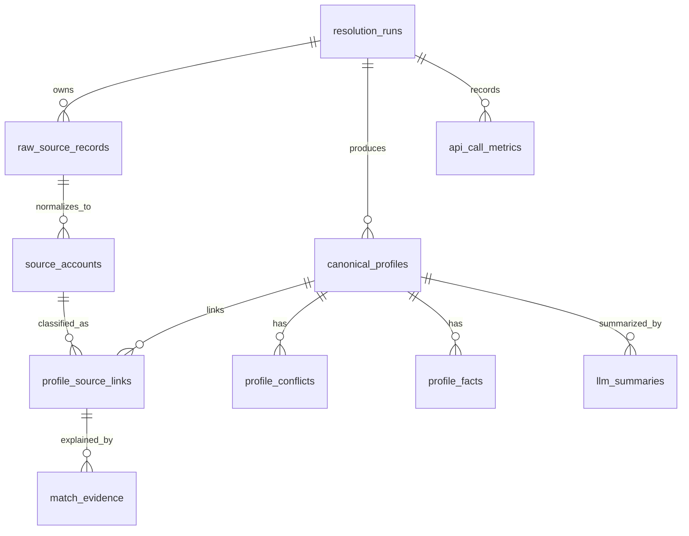

# Dev Profile Unifier

> Evidence-based developer identity resolution across GitHub, Stack Overflow, dev.to, and Hacker News.

Dev Profile Unifier is a FastAPI + Supabase service that takes a person's name and optional public platform identifiers, fetches public developer data, stores the raw source payloads, normalizes each account into a shared model, extracts evidence, detects conflicts, scores identity confidence, and builds a canonical developer profile with explainable `auto_match`, `needs_review`, and `reject` decisions.

This project is intentionally **not** a simple API aggregator. The core of the system is an auditable entity-resolution engine: every source account is preserved, every merge decision is backed by stored evidence, and ambiguous or conflicting accounts are surfaced instead of silently merged.

---

## Table of Contents

1. [What This System Does](#what-this-system-does)
2. [High-Level Architecture](#high-level-architecture)
3. [Architecture Decisions](#architecture-decisions)
4. [Project Structure](#project-structure)
5. [Request Lifecycle](#request-lifecycle)
6. [API Contract](#api-contract)
7. [Schema Design](#schema-design)
8. [Entity Resolution Strategy](#entity-resolution-strategy)
9. [LLM Usage and Guardrails](#llm-usage-and-guardrails)
10. [AI Assistant Usage Disclosure](#ai-assistant-usage-disclosure)
11. [Observability](#observability)
12. [Security and Privacy](#security-and-privacy)
13. [Local Setup](#local-setup)
14. [Supabase Setup](#supabase-setup)
15. [Running the App](#running-the-app)
16. [Testing](#testing)
17. [Deployment Notes](#deployment-notes)
18. [Example Test Cases](#example-test-cases)
19. [Known Tradeoffs](#known-tradeoffs)
20. [What I Would Do Differently With More Time](#what-i-would-do-differently-with-more-time)

---

## What This System Does

Given input such as:

```json
{
  "name": "Simon Willison",
  "github": "simonw",
  "hackernews": "simonw"
}
```

The system:

1. Creates a `resolution_run` audit record.
2. Discovers platform candidates from direct identifiers and safe URL parsing.
3. Fetches public profile data from supported APIs.
4. Stores raw API payloads before transformation.
5. Normalizes each platform account into a common `SourceAccount` shape.
6. Extracts request-to-account and account-to-account evidence.
7. Detects field conflicts across candidate accounts.
8. Scores evidence using deterministic weighted components.
9. Classifies each account into:
   - `auto_match`
   - `needs_review`
   - `reject`
10. Builds a canonical profile only from accepted accounts.
11. Optionally generates a grounded Gemini summary.
12. Exposes results through JSON APIs and a lightweight FastAPI-native UI.
13. Records API metrics, LLM metrics, rate-limit metadata, and resolution timing.

The design goal is simple: **never hide uncertainty**. If a candidate account cannot be safely linked, it is preserved for review rather than merged into the canonical profile.

---

## High-Level Architecture

```mermaid
flowchart TD
    A[Client / UI] --> B[POST /profiles/resolve]
    B --> C[ProfileOrchestrationService]
    C --> D[resolution_runs]
    C --> E[CandidateDiscoveryService]
    E --> F[Platform API Clients]
    F --> F1[GitHub]
    F --> F2[Stack Overflow]
    F --> F3[dev.to]
    F --> F4[Hacker News]
    F --> G[raw_source_records]
    G --> H[SourceAccountNormalizationService]
    H --> I[source_accounts]
    I --> J[EvidenceExtractor]
    I --> K[ConflictDetector]
    J --> L[ResolutionScorer]
    K --> L
    L --> M[DecisionClassifier]
    M --> N[Optional Gemini Ambiguity Reviewer]
    N --> O[profile_source_links]
    O --> P[match_evidence / profile_conflicts]
    O --> Q[CanonicalProfileService]
    Q --> R[canonical_profiles]
    R --> S[Optional SummaryService]
    S --> T[llm_summaries]
    B --> U[GET /profiles/{id}]
    U --> V[ProfileReadService]
    V --> W[JSON Response / UI Result Page]
```

Runtime surfaces:

| Surface      |                            Route | Purpose                                                                                                                |
| ------------ | -------------------------------: | ---------------------------------------------------------------------------------------------------------------------- |
| Resolve API  |         `POST /profiles/resolve` | Runs the full resolution workflow.                                                                                     |
| Profile API  |     `GET /profiles/{profile_id}` | Returns canonical profile, accepted sources, review candidates, rejected candidates, evidence summary, and AI summary. |
| Health API   |                    `GET /health` | Returns observability metrics as JSON.                                                                                 |
| Debug Health |   `GET /health?include_raw=true` | Includes raw view rows for local debugging.                                                                            |
| Demo UI      |                       `GET /app` | FastAPI-native resolve form.                                                                                           |
| Profile UI   | `GET /app/profiles/{profile_id}` | Human-friendly profile result view.                                                                                    |
| Dashboard    |                 `GET /dashboard` | HTML observability dashboard. Optional token protection is supported through `DASHBOARD_TOKEN`.                        |
| OpenAPI      |                      `GET /docs` | FastAPI Swagger UI.                                                                                                    |

---

## Architecture Decisions

### 1. Deterministic-first identity resolution

The system does not let an LLM decide whether two accounts belong to the same person. Identity decisions are first made by deterministic evidence extraction, conflict detection, scoring, and classification.

Gemini is allowed to help only in bounded ways:

- reviewing selected ambiguous cases when enabled;
- generating a grounded summary after canonical profile construction;
- never overriding deterministic blocking conflicts;
- never acting as the source of truth for identity ownership.

This keeps the resolver explainable and testable.

### 2. Store raw source data before transformation

Every fetched API payload is stored in `raw_source_records` before normalization. This gives the system a replayable audit trail:

- what was fetched;
- from which source;
- for which resolution run;
- with which HTTP status;
- and what raw payload was used to produce the normalized account.

This matters because identity resolution is not only a data problem; it is a trust and auditability problem.

### 3. Normalize before resolving

Each platform has a different shape:

- GitHub has repos, followers, company, website, and public profile fields.
- Stack Overflow has numeric user IDs, reputation, badges, tags, and link fields.
- dev.to has usernames, profile summaries, articles, tags, and website links.
- Hacker News has sparse profile fields and submission/comment activity.

The resolver does not work directly on raw platform payloads. It works on a normalized `SourceAccount` model so that evidence extraction is platform-agnostic.

### 4. Preserve ambiguity instead of deleting it

The system explicitly stores three decision states:

| Decision       | Meaning                                                                                    |
| -------------- | ------------------------------------------------------------------------------------------ |
| `auto_match`   | Safe enough to contribute to the canonical profile.                                        |
| `needs_review` | Plausible but not safe enough to merge. Preserved and surfaced.                            |
| `reject`       | Unsupported or conflicting candidate. Preserved for audit, excluded from canonical fields. |

This is important because public developer identity data is noisy. The correct behavior is often not “merge” or “drop”; it is “keep for review.”

### 5. Direct input is a claim, not proof

A user-provided handle or ID is treated as an input anchor, but not as external ownership verification.

For example, this request is intentionally suspicious:

```json
{
  "name": "Jon Skeet",
  "github": "simonw",
  "stackoverflow_user_id": "22656"
}
```

The system must not blindly merge both accounts just because both were typed into the request. Multiple direct inputs are compared against each other. If one direct input conflicts with another, the conflicting account is demoted to review or rejection and excluded from canonical facts.

### 6. Database-backed observability

The app records API calls, status codes, latency, GitHub rate-limit metadata, Gemini tokens, retry counts, wait time, and estimated cost. `/health` and `/dashboard` are backed by Supabase rows/views rather than in-memory counters, so metrics survive process restarts.

### 7. Backend-only Supabase access

The FastAPI service uses the Supabase service role key. Public clients do not access database tables directly. Row-level security is enabled and direct `anon` / `authenticated` table permissions are revoked.

---

## Project Structure

```text
.
├── app/
│   ├── api/
│   │   ├── health.py                  # /health and /dashboard
│   │   ├── profiles.py                # /profiles/resolve and /profiles/{id}
│   │   └── ui.py                      # /, /app, /app/profiles/{id}
│   ├── integrations/
│   │   ├── base.py                    # shared HTTP client, retry, rate-limit metric helpers
│   │   ├── github.py
│   │   ├── stackoverflow.py
│   │   ├── devto.py
│   │   └── hackernews.py
│   ├── llm/
│   │   ├── gemini_client.py           # shared Gemini client
│   │   ├── rate_limiter.py            # in-process Gemini limiter
│   │   ├── metadata.py                # normalized LLM metric metadata
│   │   ├── prompts.py                 # summary prompt contract
│   │   └── match_review_prompts.py    # ambiguity-review prompt contract
│   ├── resolution/
│   │   ├── evidence.py                # deterministic evidence extraction
│   │   ├── conflict_detector.py       # account-pair conflicts
│   │   ├── scorer.py                  # weighted confidence scoring
│   │   ├── classifier.py              # auto_match / needs_review / reject policy
│   │   ├── ambiguity_reviewer.py      # optional Gemini advisory review
│   │   └── comparators.py             # normalized comparisons for names, URLs, topics, etc.
│   ├── schemas/                       # Pydantic request/response/domain schemas
│   ├── services/
│   │   ├── candidate_discovery.py
│   │   ├── ingestion_service.py
│   │   ├── source_account_normalization_service.py
│   │   ├── resolution_service.py
│   │   ├── canonical_profile_service.py
│   │   ├── summary_service.py
│   │   ├── profile_orchestration_service.py
│   │   ├── profile_read_service.py
│   │   └── health_dashboard_service.py
│   ├── storage/                       # Supabase repositories
│   ├── ui/                            # server-rendered HTML/CSS helpers
│   ├── config.py
│   ├── dependencies.py
│   └── main.py
├── scripts/
│   ├── check_env.py
│   ├── check_supabase_connection.py
│   ├── verify_candidate_discovery.py
│   ├── verify_external_integration.py
│   └── verify_raw_ingestion.py
├── supabase/
│   └── schema.sql
├── tests/
├── requirements.txt
├── pyproject.toml
├── .env.example
└── README.md
```

---

## Request Lifecycle

### Step 1: API request validation

`POST /profiles/resolve` accepts a `ProfileResolveRequest`:

```json
{
  "name": "Ben Halpern",
  "github": "benhalpern",
  "devto": "ben",
  "hackernews": null,
  "stackoverflow_user_id": null,
  "email_hint": null
}
```

Rules:

- `name` is required.
- `github`, `devto`, and `hackernews` may be handles or profile URLs.
- `stackoverflow_user_id` must be a numeric Stack Overflow user ID or profile URL.
- `email_hint` is optional and is stored only as a SHA-256 hash in the resolution input payload.
- Extra request fields are rejected.

### Step 2: Resolution run creation

A row is inserted into `resolution_runs` with:

- safe input payload;
- status `running`;
- start timestamp;
- later source success/failure arrays;
- later result summary.

### Step 3: Candidate discovery

`CandidateDiscoveryService` turns direct platform input into candidate identities. It also safely parses supported platform URLs and avoids obvious invalid/reserved paths such as GitHub route names or dev.to article/tag paths.

Candidate discovery is intentionally conservative. If a direct platform identifier exists, name expansion is not aggressively used because that can create false positives.

### Step 4: External API ingestion

`IngestionService` calls platform clients and stores all raw responses in `raw_source_records`.

External clients are responsible for:

- timeout handling;
- platform-specific errors;
- not-found handling;
- retry behavior;
- rate-limit metadata extraction;
- API call metrics.

### Step 5: Normalization

`SourceAccountNormalizationService` loads raw records and delegates to platform normalizers:

- `GitHubNormalizer`
- `StackOverflowNormalizer`
- `DevToNormalizer`
- `HackerNewsNormalizer`

Each normalizer produces a shared `SourceAccount` model with fields such as:

- `source`
- `source_user_id`
- `handle`
- `display_name`
- `bio`
- `location`
- `website_url`
- `profile_url`
- `avatar_url`
- `email_hash`
- `topics`
- `outbound_links`
- `activity_payload`

### Step 6: Evidence extraction

`EvidenceExtractor` creates evidence from:

1. request-to-account signals;
2. account-to-account signals.

Examples:

- requested handle matches account handle;
- requested name matches display name;
- two accounts share the same personal website domain;
- one profile links to another profile;
- reciprocal profile links exist;
- email hint hash matches;
- overlapping bio keywords or topics exist.

### Step 7: Conflict detection

`ConflictDetector` identifies disagreements across candidate accounts:

- clear name conflict;
- different non-platform website domains;
- non-overlapping locations;
- email hash/domain conflicts;
- significant topic mismatch.

Conflicts reduce scores and may force review/rejection.

### Step 8: Scoring

`ResolutionScorer` turns evidence and conflicts into account-level and pair-level confidence scores. It applies independence-group caps so repeated weak evidence cannot overwhelm a stronger identity signal.

Example: ten topic overlaps should not outweigh a reciprocal profile link or matching email hint.

### Step 9: Classification

`DecisionClassifier` turns scores into final account decisions:

- accepted account → `auto_match`;
- plausible but unsafe account → `needs_review`;
- unsupported or conflicting account → `reject`.

Important policy: a direct user-provided platform identifier can become an anchor, but multiple direct anchors must still be internally consistent.

### Step 10: Optional Gemini ambiguity review

If `ENABLE_LLM_AMBIGUOUS_REVIEW` is enabled, selected ambiguous `needs_review` accounts may be sent to Gemini for advisory review. This does not bypass deterministic guardrails.

### Step 11: Persistence

The resolution result is persisted into:

- `canonical_profiles`
- `profile_source_links`
- `match_evidence`
- `profile_conflicts`
- `resolution_runs.result_summary`

### Step 12: Canonical profile build

`CanonicalProfileService` builds canonical profile fields only from accepted `auto_match` sources.

`needs_review` and `reject` accounts are preserved in `profile_payload` for transparency, but do not contribute factual canonical fields.

### Step 13: Optional AI summary

`SummaryService` generates a grounded summary from the deterministic canonical profile. The summary is stored in `llm_summaries` and reflected in the API response.

---

## API Contract

### `POST /profiles/resolve`

Runs the full pipeline.

Query parameters:

| Parameter                | Default | Description                                             |
| ------------------------ | ------: | ------------------------------------------------------- |
| `build_summary`          |  `true` | Generate Gemini summary after deterministic resolution. |
| `allow_summary_fallback` |  `true` | Use deterministic fallback summary if Gemini fails.     |

Request body:

```json
{
  "name": "Simon Willison",
  "github": "simonw",
  "devto": null,
  "hackernews": "simonw",
  "stackoverflow_user_id": null,
  "email_hint": null
}
```

Response shape:

```json
{
  "profile_id": "uuid",
  "resolution_run_id": "uuid",
  "display_name": "Simon Willison",
  "headline": "...",
  "location": "...",
  "bio": "...",
  "primary_avatar_url": "...",
  "primary_website_url": "...",
  "inferred_skills": ["python", "django", "llm"],
  "confidence_level": "high",
  "sources": [],
  "review_candidates": [],
  "rejected_candidates": [],
  "ai_summary": {},
  "evidence_summary": {},
  "resolution_summary": {},
  "warnings": []
}
```

### `GET /profiles/{profile_id}`

Returns the read model for a canonical profile.

This route does not call external APIs, mutate decisions, or regenerate summaries. It reads from persisted canonical profile data and latest summary rows.

### `GET /health`

Returns DB-backed health and observability metrics:

- resolution run counts;
- average resolution duration;
- external API call counts;
- GitHub rate-limit status;
- Gemini token/cost/retry/wait metrics;
- warnings if health views are unavailable.

### `GET /dashboard`

Renders the same observability data as HTML. If `DASHBOARD_TOKEN` is configured, the dashboard requires either:

```text
/dashboard?token=YOUR_TOKEN
```

or:

```text
Authorization: Bearer YOUR_TOKEN
```

### `GET /app`

Renders a lightweight server-side UI for demo usage.

---

## Schema Design

The database schema is designed around auditability and separation of concerns:



### Enum types

| Enum                       | Values                                                                                                               | Purpose                                                |
| -------------------------- | -------------------------------------------------------------------------------------------------------------------- | ------------------------------------------------------ |
| `platform_source`          | `github`, `stackoverflow`, `devto`, `hackernews`                                                                     | Supported public profile sources.                      |
| `metric_source`            | platform sources + `gemini`, `supabase`                                                                              | Sources tracked by observability.                      |
| `resolution_status`        | `running`, `resolved`, `partial`, `failed`                                                                           | Lifecycle state for a resolution run.                  |
| `profile_confidence_level` | `high`, `medium`, `low`, `uncertain`                                                                                 | Canonical profile-level confidence.                    |
| `match_decision`           | `auto_match`, `needs_review`, `reject`                                                                               | Account classification result.                         |
| `source_relationship_type` | `primary`, `secondary`, `alias`, `possible_alias`, `rejected`                                                        | How a source account relates to the canonical profile. |
| `verification_status`      | `claimed_by_input`, `evidence_matched`, `reciprocal_link_verified`, `likely_same_person`, `needs_review`, `rejected` | Trust/verification state.                              |
| `evidence_direction`       | `positive`, `negative`, `neutral`                                                                                    | Direction of an evidence item.                         |
| `conflict_severity`        | `low`, `medium`, `high`                                                                                              | Impact level for conflicts.                            |

### `resolution_runs`

One row per `POST /profiles/resolve` request.

Key fields:

| Column                                                     | Purpose                                                |
| ---------------------------------------------------------- | ------------------------------------------------------ |
| `input_name`                                               | Required person name from the request.                 |
| `input_payload`                                            | Safe validated input payload. Raw email is not stored. |
| `status`                                                   | `running`, `resolved`, `partial`, or `failed`.         |
| `started_at`, `completed_at`, `duration_ms`                | Timing.                                                |
| `sources_attempted`, `sources_succeeded`, `sources_failed` | Source-level execution summary.                        |
| `source_errors`                                            | Structured source errors.                              |
| `result_summary`                                           | Run-level pipeline summary and later-phase metadata.   |

Design rationale:

- Keeps each resolution auditable.
- Allows failed/partial runs to be inspected.
- Decouples request history from the final canonical profile.

### `raw_source_records`

Stores original API responses before transformation.

Key fields:

| Column                       | Purpose                                            |
| ---------------------------- | -------------------------------------------------- |
| `resolution_run_id`          | Ties raw data to one request.                      |
| `source`                     | Platform source.                                   |
| `source_record_type`         | Example: profile, repos, answers, articles, items. |
| `source_user_id`, `handle`   | Platform identity metadata.                        |
| `request_url`, `profile_url` | Traceability.                                      |
| `http_status`                | Source response status.                            |
| `raw_payload`                | Original JSON payload.                             |
| `payload_sha256`             | Optional payload hash for dedupe/debugging.        |

Design rationale:

- Raw data is the source of truth for audit/replay.
- Normalization bugs can be debugged without refetching.

### `source_accounts`

Stores normalized platform accounts.

Key fields:

| Column                                       | Purpose                                      |
| -------------------------------------------- | -------------------------------------------- |
| `source`                                     | Platform.                                    |
| `source_user_id`                             | Platform-specific stable ID when available.  |
| `handle`                                     | Username/handle.                             |
| `source_account_key`                         | Stable unique key such as `github:12345678`. |
| `display_name`, `bio`, `location`, `company` | Common profile fields.                       |
| `website_url`, `profile_url`, `avatar_url`   | Public links.                                |
| `email_hash`                                 | Hash only. Raw email is not stored.          |
| `topics`                                     | Normalized languages/tags/topics.            |
| `outbound_links`                             | Links discovered from profile/account data.  |
| `activity_payload`                           | Compact platform activity summary.           |
| `raw_source_record_id`                       | Back-reference to source payload.            |

Design rationale:

- Provides a stable platform-neutral account model.
- Keeps resolver code independent from raw API shape.
- Uses a trigger-generated `source_account_key` rather than a generated column because enum-to-text casts can cause immutability issues in PostgreSQL generated expressions.

### `canonical_profiles`

Stores the derived unified developer profile.

Key fields:

| Column                                        | Purpose                                                                                                 |
| --------------------------------------------- | ------------------------------------------------------------------------------------------------------- |
| `resolution_run_id`                           | Originating run.                                                                                        |
| `display_name`, `headline`, `location`, `bio` | Canonical fields derived from accepted accounts only.                                                   |
| `primary_avatar_url`, `primary_website_url`   | Best accepted media/link fields.                                                                        |
| `inferred_skills`                             | Merged normalized skills/topics.                                                                        |
| `confidence_level`                            | Profile-level confidence.                                                                               |
| `profile_payload`                             | Structured read-model payload, including accepted/review/rejected candidates and field source metadata. |

Design rationale:

- Canonical profile is derived data, not the raw source of truth.
- `profile_payload` provides API flexibility without forcing a schema migration for every display/read-model field.

### `profile_source_links`

Decision table linking canonical profiles to source accounts.

Key fields:

| Column                                           | Purpose                                                           |
| ------------------------------------------------ | ----------------------------------------------------------------- |
| `profile_id`                                     | Canonical profile.                                                |
| `source_account_id`                              | Normalized account.                                               |
| `confidence_score`                               | Final decision confidence.                                        |
| `decision`                                       | `auto_match`, `needs_review`, or `reject`.                        |
| `relationship_type`                              | `primary`, `secondary`, `alias`, `possible_alias`, or `rejected`. |
| `verification_status`                            | Trust/verification state.                                         |
| `positive_signal_count`, `negative_signal_count` | Evidence summary.                                                 |
| `has_high_conflict`                              | Whether a high-severity conflict exists.                          |
| `decision_payload`                               | Structured classifier/LLM rationale and policy metadata.          |

Design rationale:

- Separates source account identity from canonical profile membership.
- Makes every merge/review/reject decision inspectable.
- Allows review candidates to be preserved without contaminating canonical fields.

### `match_evidence`

Stores individual evidence items.

Key fields:

| Column                                         | Purpose                                |
| ---------------------------------------------- | -------------------------------------- |
| `resolution_run_id`                            | Run-level audit anchor.                |
| `profile_source_link_id`                       | Link-level audit anchor.               |
| `source_account_a_id`, `source_account_b_id`   | Pairwise evidence traceability.        |
| `signal_type`                                  | Evidence type, such as `same_website`. |
| `direction`                                    | Positive, negative, or neutral.        |
| `signal_weight`                                | Signed evidence weight.                |
| `source_a`, `source_b`                         | Platform pair.                         |
| `field_name`, `field_value_a`, `field_value_b` | Evidence field values.                 |
| `explanation`                                  | Human-readable reason.                 |

Design rationale:

- Gives explainability beyond a single numeric score.
- Allows future UI/debug tools to show why the resolver made a decision.

### `profile_conflicts`

Stores detected disagreements.

Key fields:

| Column                            | Purpose                        |
| --------------------------------- | ------------------------------ |
| `resolution_run_id`, `profile_id` | Audit anchors.                 |
| `field_name`                      | Conflict type.                 |
| `severity`                        | Low/medium/high.               |
| `impact`                          | Negative scoring impact.       |
| `source_values`                   | Structured conflicting values. |
| `explanation`                     | Human-readable description.    |

Design rationale:

- Conflicts are first-class data, not hidden scoring internals.
- Useful for manual review, debugging, and explaining lower confidence.

### `profile_facts`

Stores normalized facts attached to canonical profiles.

Examples:

- skills;
- GitHub languages;
- Stack Overflow tags;
- dev.to article tags;
- repo names;
- article titles;
- platform-specific profile facts.

### `llm_summaries`

Stores Gemini-generated summaries.

Key fields:

| Column                          | Purpose                   |
| ------------------------------- | ------------------------- |
| `profile_id`                    | Profile being summarized. |
| `model`                         | Gemini model.             |
| `prompt_version`                | Prompt contract version.  |
| `prompt_text`                   | Actual prompt sent.       |
| `summary`                       | Stored summary JSON/text. |
| `input_tokens`, `output_tokens` | Token observability.      |
| `estimated_cost_usd`            | Cost tracking.            |

### `api_call_metrics`

Stores one metric row per external API/LLM call.

Key fields:

| Column                                                            | Purpose                                                                    |
| ----------------------------------------------------------------- | -------------------------------------------------------------------------- |
| `resolution_run_id`                                               | Optional run association.                                                  |
| `source`                                                          | `github`, `stackoverflow`, `devto`, `hackernews`, `gemini`, or `supabase`. |
| `endpoint`, `http_method`, `status_code`                          | Call metadata.                                                             |
| `duration_ms`                                                     | Latency.                                                                   |
| `error_message`                                                   | Failure details.                                                           |
| `rate_limit_remaining`, `rate_limit_total`, `rate_limit_reset_at` | Rate-limit visibility.                                                     |
| `metadata`                                                        | Retry count, wait time, token estimates, raw provider details.             |

### Health views

The schema includes read views:

| View                              | Purpose                                                       |
| --------------------------------- | ------------------------------------------------------------- |
| `health_profile_metrics`          | Resolved/partial/failed counts and average resolution timing. |
| `health_api_call_metrics`         | External API calls and error counts by source.                |
| `health_latest_github_rate_limit` | Latest observed GitHub quota state.                           |
| `health_llm_metrics`              | Summary count, token totals, cost, latest model.              |

---

## Entity Resolution Strategy

The resolver is split into explicit stages so that each stage is testable and explainable.

### 1. Candidate discovery

Direct user input is parsed into platform candidates. Supported inputs:

| Platform       | Accepted input                                |
| -------------- | --------------------------------------------- |
| GitHub         | handle or GitHub profile URL                  |
| Stack Overflow | numeric user ID or Stack Overflow profile URL |
| dev.to         | handle or DEV profile URL                     |
| Hacker News    | HN username                                   |

Candidate generation is conservative by default. The system avoids broad name-based expansion when direct identifiers are present because public developer names are not unique.

### 2. Evidence extraction

Evidence is extracted from the request and between account pairs.

| Evidence type             | Weight | Independence group | Description                                                      |
| ------------------------- | -----: | ------------------ | ---------------------------------------------------------------- |
| `input_handle_match`      | `0.25` | `input_identifier` | Account matches the platform identifier supplied by the request. |
| `exact_name_match`        | `0.20` | `name`             | Account display name exactly matches request name.               |
| `partial_name_match`      | `0.10` | `name`             | Display name partially matches request name.                     |
| `same_website`            | `0.30` | `website`          | Accounts share the same personal website domain.                 |
| `direct_profile_link`     | `0.40` | `profile_link`     | One account links directly to another account's profile.         |
| `reciprocal_profile_link` | `0.45` | `profile_link`     | Both accounts link to each other.                                |
| `similar_handle`          | `0.12` | `handle`           | Handles are similar after normalization.                         |
| `email_hint_match`        | `0.35` | `email`            | Account email hash matches optional user email hint.             |
| `email_domain_match`      | `0.12` | `email`            | Email domains align when available and non-generic.              |
| `same_location`           | `0.08` | `location`         | Locations normalize to the same value.                           |
| `location_overlap`        | `0.05` | `location`         | Locations partially overlap.                                     |
| `bio_keyword_overlap`     | `0.08` | `bio`              | Bios share meaningful keywords.                                  |
| `topic_overlap`           | `0.06` | `topics`           | Topic/tag/language overlap. Capped by group.                     |

### 3. Conflict detection

The resolver detects negative account-pair signals:

| Conflict type       | Severity | Typical meaning                                         |
| ------------------- | -------- | ------------------------------------------------------- |
| `name_conflict`     | High     | Strong display names clearly point to different people. |
| `email_conflict`    | High     | Email hashes/domains conflict.                          |
| `website_conflict`  | Medium   | Accounts list different non-platform personal domains.  |
| `location_conflict` | Low      | Locations do not overlap.                               |
| `topic_mismatch`    | Low      | Topic sets are meaningfully different without support.  |

Topic mismatch alone should not reject an account. It is a weak negative signal. Name/email/website conflicts are much more important.

### 4. Scoring

The scorer computes:

- account-level confidence;
- account-pair confidence;
- positive score;
- conflict penalty;
- independent evidence groups;
- strong evidence groups;
- weak-only signal flags;
- Hacker News conservative flags.

Important scoring rules:

- Confidence is capped at `0.97`.
- Auto-match threshold defaults to `0.85`.
- Needs-review threshold defaults to `0.60`.
- Repeated signals from the same independence group are capped.
- Strong pair groups are website, profile link, and email.
- Weak groups such as location, bio, and topics cannot carry a merge by themselves.

### 5. Classification

The classifier applies policy to the score outputs.

General rules:

- `auto_match` requires enough confidence and evidence diversity.
- `needs_review` preserves plausible but unsafe accounts.
- `reject` excludes unsupported/conflicting accounts from canonical fields.
- Hacker News accounts require stronger evidence because HN profiles are sparse.
- Direct user-provided platform IDs are treated as claims, not verified ownership.

### 6. Multi-anchor consistency gate

This is one of the most important safety policies in the resolver.

If a user provides multiple platform identifiers, the system does not automatically accept all of them. It compares the direct-input anchors against each other.

Example:

```json
{
  "name": "Jon Skeet",
  "github": "simonw",
  "stackoverflow_user_id": "22656"
}
```

Correct behavior:

| Source                 | Expected result | Reason                                                                         |
| ---------------------- | --------------- | ------------------------------------------------------------------------------ |
| Stack Overflow `22656` | accepted        | Display name matches Jon Skeet.                                                |
| GitHub `simonw`        | review/reject   | Strong name conflict and no corroborating evidence connecting it to Jon Skeet. |

This prevents a dangerous failure mode where the system merges contradictory user-supplied accounts into one canonical identity.

### 7. Canonical profile construction

Only `auto_match` accounts contribute canonical fields.

`needs_review` and `reject` accounts are kept in the payload for transparency but excluded from factual fields such as:

- display name;
- headline;
- bio;
- location;
- website;
- avatar;
- inferred skills.

This keeps the canonical profile conservative and avoids contaminating the output with questionable data.

---

## LLM Usage and Guardrails

The project uses Gemini in two bounded places.

### Optional ambiguity reviewer

`GeminiAmbiguityReviewer` can review selected ambiguous `needs_review` cases when enabled.

Guardrails:

- It receives structured evidence, not arbitrary raw profile dumps.
- It cannot promote accounts with deterministic blocking conflicts.
- It cannot override the deterministic identity policy.
- Its output is advisory and stored in decision metadata.

### Summary service

`SummaryService` generates a profile summary after the deterministic canonical profile is built.

Guardrails:

- It only summarizes accepted canonical data.
- It must use cautious language such as “appears to” and “based on accepted public profiles.”
- It must not claim verified ownership.
- It must not name rejected or review-only accounts as factual profile sources.
- If Gemini fails and fallback is allowed, a deterministic fallback summary can be stored.

### LLM infrastructure

The Gemini client includes:

- shared in-process rate limiter;
- retry config;
- retry metadata;
- token usage metadata;
- estimated cost metadata;
- prompt/version metadata;
- free-tier-friendly defaults.

Relevant environment variables:

```env
GEMINI_API_KEY=
GEMINI_MODEL=gemini-2.5-flash-lite
GEMINI_TIMEOUT_SECONDS=30
GEMINI_MAX_RETRIES=2
GEMINI_RATE_LIMIT_ENABLED=true
GEMINI_REQUESTS_PER_MINUTE=5
GEMINI_TOKENS_PER_MINUTE=30000
GEMINI_REQUESTS_PER_DAY=500
GEMINI_MIN_REQUEST_INTERVAL_SECONDS=12.0
GEMINI_RATE_LIMIT_MAX_WAIT_SECONDS=60.0
```

---

## AI Assistant Usage Disclosure

AI assistants such as ChatGPT, Claude Code, Cursor, and similar tools were used as productivity and review aids during the project. Their usage was not treated as a replacement for system design, engineering judgment, implementation ownership, or final validation.

My workflow was:

1. First, I designed the system architecture, requirements, data flow, reliability model, and core implementation approach myself.
2. After the initial design, I used AI assistants to critically review the system design, identify possible reliability gaps, question edge cases, and evaluate whether the approach was safe enough for an auditable identity-resolution system.
3. Based on that feedback, I refined the architecture and redesigned parts of the system where needed, especially around reliability, deterministic decision-making, conflict handling, observability, and failure safety.
4. Once the requirements, design decisions, edge cases, API contracts, schema structure, and guardrails were properly identified, I converted the plan into a PRD-style implementation roadmap and used that to guide development.
5. During implementation, I used AI assistants to speed up debugging, regression-test planning, test-case generation, and review of failure scenarios.
6. Final decisions, design tradeoffs, code integration, and validation remained my responsibility.

The main benefit of using AI assistants was faster iteration. They helped me challenge assumptions, catch missing edge cases, improve reliability thinking, and debug more efficiently. This allowed the project to move faster while still keeping the system grounded in deterministic logic, explicit evidence, test coverage, and conservative merge decisions.

## Observability

Observability is stored in Supabase and exposed through `/health` and `/dashboard`.

Tracked areas:

| Area             | What is tracked                                                                      |
| ---------------- | ------------------------------------------------------------------------------------ |
| Resolution       | total resolved/partial/failed runs, average duration, source success/failure arrays. |
| External APIs    | call count, success/failure count, latency, status code, error message.              |
| GitHub quota     | latest remaining/limit/reset metadata from GitHub headers.                           |
| Gemini           | token usage, retry count, limiter wait time, model, estimated cost.                  |
| Dashboard status | degraded if DB views cannot be read.                                                 |

The dashboard is intentionally DB-backed instead of process-memory-backed, so metrics remain visible after restart/deploy.

---

## Security and Privacy

Security decisions:

1. **No direct public database access**  
   Supabase tables have RLS enabled. Direct `anon` and `authenticated` access is revoked. FastAPI uses the service role key on the server side.

2. **No raw email storage from user input**  
   `email_hint` is hashed with SHA-256 and stored as `email_hint_sha256` in `resolution_runs.input_payload`.

3. **Secrets never returned in health responses**  
   `Settings.safe_runtime_config()` returns only safe config state and missing-setting flags.

4. **Dashboard token support**  
   `/dashboard` can be protected with `DASHBOARD_TOKEN`.

5. **HTML escaping in UI**  
   The FastAPI-native UI escapes dynamic values and blocks unsafe URL schemes such as `javascript:` for rendered links/images.

6. **LLM prompt safety**  
   The LLM is instructed not to treat untrusted source text as instructions and not to claim verification beyond the accepted evidence.

---

## Local Setup

### 1. Create and activate a virtual environment

Windows PowerShell / CMD:

```bash
python -m venv venv
venv\Scripts\activate
```

If your shell is already inside the venv, commands may appear as:

```bash
venv\python.exe -m ...
```

### 2. Install dependencies

```bash
pip install -r requirements.txt
```

### 3. Create `.env`

```bash
copy .env.example .env
```

Fill in:

```env
SUPABASE_URL=https://your-project.supabase.co
SUPABASE_SERVICE_ROLE_KEY=your-service-role-key
SUPABASE_ANON_KEY=your-anon-key
GITHUB_TOKEN=your-github-token
STACKEXCHANGE_KEY=your-stackexchange-key
GEMINI_API_KEY=your-gemini-api-key
APP_ENV=development
```

`STACKEXCHANGE_KEY` is recommended but not strictly required for local smoke tests. Stack Exchange works without a key at lower quota.

### 4. Validate environment

```bash
venv\python.exe scripts\check_env.py
```

---

## Supabase Setup

1. Create a Supabase project.
2. Open the SQL editor.
3. Run:

```sql
-- paste and execute supabase/schema.sql
```

The schema creates:

- enum types;
- all core tables;
- indexes;
- triggers;
- health views;
- RLS and permission revocations.

After schema changes, reload PostgREST schema cache:

```sql
notify pgrst, 'reload schema';
```

Useful verification query:

```sql
select
  table_name,
  column_name,
  data_type,
  udt_name
from information_schema.columns
where table_schema = 'public'
  and table_name in (
    'resolution_runs',
    'raw_source_records',
    'source_accounts',
    'canonical_profiles',
    'profile_source_links',
    'match_evidence',
    'profile_conflicts',
    'profile_facts',
    'llm_summaries',
    'api_call_metrics'
  )
order by table_name, ordinal_position;
```

Important columns added in later phases:

```sql
alter table public.profile_source_links
add column if not exists decision_payload jsonb not null default '{}'::jsonb;

alter table public.resolution_runs
add column if not exists result_summary jsonb not null default '{}'::jsonb;
```

---

## Running the App

Start the development server:

```bash
venv\python.exe -m uvicorn app.main:app --reload
```

Open:

```text
http://127.0.0.1:8000/app
http://127.0.0.1:8000/docs
http://127.0.0.1:8000/health
http://127.0.0.1:8000/dashboard
```

Example API call:

```bash
curl -X POST http://127.0.0.1:8000/profiles/resolve ^
  -H "Content-Type: application/json" ^
  -d "{\"name\":\"Simon Willison\",\"github\":\"simonw\"}"
```

Disable summary generation for faster deterministic tests:

```bash
curl -X POST "http://127.0.0.1:8000/profiles/resolve?build_summary=false" ^
  -H "Content-Type: application/json" ^
  -d "{\"name\":\"Simon Willison\",\"github\":\"simonw\"}"
```

---

## Testing

Compile first:

```bash
venv\python.exe -m compileall app tests
```

Run deterministic unit tests:

```bash
venv\python.exe -m pytest tests/test_evidence_extraction.py -q
venv\python.exe -m pytest tests/test_conflict_detection.py -q
venv\python.exe -m pytest tests/test_resolution_scorer.py -q
venv\python.exe -m pytest tests/test_decision_classifier.py -q
venv\python.exe -m pytest tests/test_canonical_profile_service.py -q
venv\python.exe -m pytest tests/test_summary_service.py -q
venv\python.exe -m pytest tests/test_health_dashboard_service.py -q
venv\python.exe -m pytest tests/test_phase10_routes.py tests/test_ui_routes.py -q
```

Run the broad local suite while excluding live Supabase workflow tests if Supabase is unavailable:

```bash
venv\python.exe -m pytest tests -q -k "not source_account_normalization_workflow"
```

Live integration tests require valid Supabase and external API credentials.

---

## Deployment Notes

This app can run on Render as a Python web service.

Recommended service settings:

| Setting       | Value                                              |
| ------------- | -------------------------------------------------- |
| Runtime       | Python                                             |
| Build command | `pip install -r requirements.txt`                  |
| Start command | `uvicorn app.main:app --host 0.0.0.0 --port $PORT` |
| Environment   | `production`                                       |

Required production environment variables:

```env
APP_ENV=production
SUPABASE_URL=
SUPABASE_SERVICE_ROLE_KEY=
GITHUB_TOKEN=
GEMINI_API_KEY=
```

Recommended:

```env
SUPABASE_ANON_KEY=
STACKEXCHANGE_KEY=
DASHBOARD_TOKEN=
BACKEND_CORS_ORIGINS=https://your-frontend-or-render-domain
```

Production startup validates required secrets through `Settings.assert_production_ready()`.

---

## Example Test Cases

### Single-platform smoke tests

GitHub only:

```json
{
  "name": "Simon Willison",
  "github": "simonw"
}
```

Stack Overflow only:

```json
{
  "name": "Jon Skeet",
  "stackoverflow_user_id": "22656"
}
```

DEV only:

```json
{
  "name": "Ben Halpern",
  "devto": "ben"
}
```

Hacker News only:

```json
{
  "name": "Patrick McKenzie",
  "hackernews": "patio11"
}
```

### Positive multi-platform case

```json
{
  "name": "Ben Halpern",
  "github": "benhalpern",
  "devto": "ben"
}
```

Expected behavior:

- accepted account(s) appear under `sources`;
- plausible but insufficient accounts remain in `review_candidates`;
- canonical fields are built from accepted accounts only.

### Conflict test

```json
{
  "name": "Jon Skeet",
  "github": "simonw",
  "stackoverflow_user_id": "22656"
}
```

Expected behavior:

- Stack Overflow `22656` may be accepted because it matches Jon Skeet.
- GitHub `simonw` should not be confidently merged into Jon Skeet's canonical profile.
- The conflicting account should be preserved as review/reject, not silently discarded.

---

## Known Tradeoffs

### 1. Synchronous resolution

The pipeline runs synchronously inside the request path. This is simpler for a take-home project and easier to demo, but long source timeouts or LLM calls can increase request duration.

### 2. In-process Gemini limiter

The Gemini limiter is process-local. That is acceptable for a single Render instance, but multi-instance production would need a shared limiter backed by Redis, Postgres advisory locks, or a queue.

### 3. Public data cannot prove identity ownership

This system can infer likely matches from public evidence, but it cannot prove account ownership without OAuth or platform verification. The language and schema intentionally distinguish “claimed input” from “verified ownership.”

### 4. Hacker News is sparse

HN profiles usually contain less structured identity data. The resolver treats HN as conservative: handle/name/topic similarity alone should not auto-match HN accounts without stronger corroboration.

### 5. Name-only discovery is intentionally limited in the current version

The current implementation is strongest when the user supplies at least one platform identifier. A production-grade system should add search-backed name-only discovery, candidate clustering, and ranking. That is intentionally listed as future work because broad name search can create false positives if it is not paired with strict evidence ranking and conservative abstention.

### 6. `profile_payload` trades schema rigidity for read-model flexibility

The canonical profile keeps main display fields in columns, while storing richer read-model details in JSONB. This speeds iteration but would need stronger versioning/migrations as the product grows.

---

## What I Would Do Differently With More Time

The current implementation is intentionally deterministic-first: it stores raw evidence, normalizes accounts, extracts weighted signals, detects conflicts, and applies explicit merge/review/reject policy. That is the right foundation for a trustworthy first version because entity resolution must be explainable and auditable.

With more time, I would evolve this into a more intelligent **agentic entity-resolution system** while keeping deterministic safeguards as the final safety layer.

### 1. Build an AI-assisted resolution agent, not an AI-only resolver

The biggest improvement would be to add an agentic resolution layer that can reason across incomplete public data, plan follow-up searches, compare contradictory evidence, and decide what information is still missing.

The important design choice is that the AI agent should not blindly replace deterministic logic. Instead, I would use a hybrid architecture:

```text
AI agent discovers and investigates candidates
        ↓
AI agent proposes evidence-backed hypotheses
        ↓
Deterministic resolver validates conflicts, thresholds, and merge safety
        ↓
System auto-resolves only when confidence is high
        ↓
Ambiguous cases are preserved as needs_review instead of forced merges
```

This would make the system more intelligent without losing the core trust model. The agent can help with reasoning, but the platform should still require evidence, provenance, conflict checks, and abstention when the data is weak.

### 2. Add name-only candidate discovery and ranking

Currently, the safest flow is when the user provides at least one platform identifier such as a GitHub handle, Stack Overflow user ID, dev.to handle, or Hacker News username.

With more time, I would support a much stronger flow:

```json
{
  "name": "Jane Developer"
}
```

For name-only input, the system would:

1. search supported platforms for likely accounts related to the name;
2. fetch profile candidates from GitHub, Stack Overflow, dev.to, Hacker News, and possibly personal websites;
3. normalize every candidate into `source_accounts`;
4. rank candidates by name match, handle similarity, website links, location, topics, activity, profile references, and cross-platform evidence;
5. group candidates into possible identity clusters;
6. show the top-ranked candidates with explanations;
7. auto-build a canonical profile only if the evidence is strong enough;
8. otherwise return ranked candidates with `needs_review` instead of pretending the match is certain.

This would make the product much more useful because the user would not need to know every platform handle upfront. They could start with just a name, and the system would perform intelligent discovery and comparison.

### 3. Add specialized agents inside the resolution pipeline

I would split the agentic workflow into small, bounded agents rather than one large general-purpose prompt.

| Agent                     | Responsibility                                                                                          |
| ------------------------- | ------------------------------------------------------------------------------------------------------- |
| Candidate Discovery Agent | Generate search plans and discover possible accounts from a name, handle, website, or email hint.       |
| Source Retrieval Agent    | Decide which public APIs or pages to fetch next within a strict query budget.                           |
| Evidence Extraction Agent | Identify meaningful evidence from bios, websites, linked profiles, repos, answers, posts, and activity. |
| Conflict Analysis Agent   | Explain why two accounts may represent different people and identify the strongest blocking conflicts.  |
| Ranking Agent             | Rank candidate accounts and candidate clusters by evidence strength and uncertainty.                    |
| Self-Audit Agent          | Check whether the proposed resolution is overconfident, missing sources, or relying on weak evidence.   |

Each agent would produce structured JSON with citations/provenance, not free-form conclusions. The deterministic resolver would then validate that output.

### 4. Add autonomous follow-up search loops

A more advanced version would let the system ask itself:

- “Do these two accounts share a personal website?”
- “Does the GitHub profile link to the dev.to profile?”
- “Does the personal website mention the Stack Overflow account?”
- “Are there multiple people with this same name?”
- “Is this candidate only a handle collision?”
- “What evidence would be needed before this can become an auto-match?”

The resolver could run bounded follow-up loops until one of these outcomes is reached:

| Outcome         | Meaning                                                                  |
| --------------- | ------------------------------------------------------------------------ |
| `resolved`      | Strong evidence supports the canonical profile.                          |
| `partial`       | Some accounts are accepted, but some remain uncertain.                   |
| `needs_review`  | Plausible identity cluster, but not enough evidence to auto-merge.       |
| `no_safe_match` | Candidates exist, but none can be safely linked to the requested person. |

This would reduce manual intervention while still avoiding unsafe merges.

### 5. Keep human review for high-risk ambiguity

I would not fully remove human review from the system. In entity resolution, the worst failure is confidently merging two different people.

So the goal is not “AI always decides.” The goal is:

```text
AI handles discovery, reasoning, and evidence collection.
Deterministic policy handles safety.
Humans only review cases where evidence is genuinely ambiguous.
```

That is the safest production direction.

### 6. Add a durable job queue

The current pipeline runs synchronously inside the request path. For production, I would move resolution into a background job system:

- `POST /profiles/resolve` returns a run ID immediately;
- workers process ingestion, resolution, candidate expansion, and summary asynchronously;
- the UI polls a run-status endpoint;
- retries become more reliable;
- long-running AI/search workflows do not block the HTTP request.

A good production option would be Redis Queue, Celery, or a Postgres-backed job leasing system.

### 7. Add manual review workflow

The system already preserves `needs_review` candidates. The next product step is a review UI/API:

- accept candidate;
- reject candidate;
- override relationship type;
- store reviewer/action metadata;
- rebuild canonical profile after review.

This would turn the resolver into a practical human-in-the-loop identity platform.

### 8. Add OAuth verification mode

Public evidence is useful but not proof. For stronger verification, I would add OAuth flows:

- connect GitHub account;
- connect Stack Overflow if supported;
- confirm account ownership claims;
- separate `claimed_by_input` from `oauth_verified`.

This would let the product distinguish inferred identity from verified ownership.

### 9. Add more source platforms

Useful next platforms:

- GitLab;
- Bitbucket;
- npm;
- PyPI;
- Kaggle;
- ORCID;
- LinkedIn where allowed;
- personal websites and blog RSS feeds.

The current normalized `SourceAccount` model can support this with additional normalizers and source enums.

### 10. Add richer evidence explanations in UI

The backend stores evidence and conflicts, but the UI could show a full evidence explorer:

- why each source was accepted, reviewed, or rejected;
- which exact fields matched;
- which conflicts lowered confidence;
- which source provided each canonical field;
- how the score changed after each evidence group.

This would make the system easier to trust and debug.

### 11. Add schema versioning for `profile_payload`

The JSONB read model should eventually include explicit schema versions:

```json
{
  "schema_version": "canonical_profile_payload_v2",
  "generated_at": "...",
  "builder_version": "..."
}
```

That would make future migrations safer as the product evolves.

### 12. Add integration contract tests against a seeded Supabase project

The unit tests cover the resolver heavily. The next level would be a seeded Supabase test project or local Postgres test harness that validates:

- schema compatibility;
- repository writes;
- PostgREST behavior;
- RLS assumptions;
- health view outputs;
- full API workflow.

### 13. Add multi-instance-safe observability aggregation

The current metrics are stored durably, but aggregation is read directly from views/tables. For high-traffic production I would add:

- time-windowed metrics;
- source-level percentile latency;
- daily quota views;
- error-rate alerts;
- background metric compaction.

### 14. Separate assignment demo UI from production admin UI

The FastAPI-native UI is intentionally lightweight and deployment-simple. A production admin UI would likely become a separate frontend with:

- authentication;
- review workflow;
- searchable profiles;
- detailed evidence explorer;
- observability drilldowns.

## Design Summary

The core principle of Dev Profile Unifier is:

> A unified profile is only as trustworthy as the evidence behind each merge.

That principle shaped the system:

- raw data is stored before transformation;
- normalized accounts are separate from canonical profiles;
- evidence and conflicts are persisted;
- direct user input is treated as a claim, not proof;
- ambiguous candidates are preserved;
- canonical fields only use accepted accounts;
- LLMs summarize and assist, but do not own identity decisions;
- observability is database-backed and inspectable.

The result is a developer profile unifier that is explainable, conservative, auditable, and designed to fail safely when identity evidence is weak.
